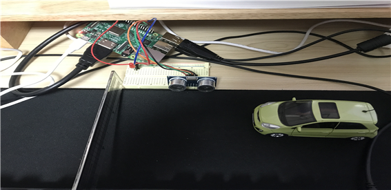
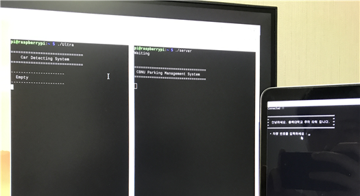

# :satellite: 인터넷통신설계 (Internet Communication Design Class)

## 주차장 출입문 관리 시스템

## 1. 프로젝트 목적

&nbsp;&nbsp;우리 주변에 있는 아파트, 상가 그리고 학교 등에서 쉽게 볼 수 있는 `주차 관리 시스템 설계`

## 2. 사용 언어

 
    

## 3. 기능 소개

&nbsp;&nbsp;초음파 센서를 통해 차량이 주차장 입구에 접근 여부를 감지하고 감지와 동시에 차량이 감지되었다는 안내 문구 출력과 LED 등을 깜박이게 설계하였다. 

  주차장에 진입하려는 운전자가 주차장 입구에서 자신의 차량 번호를 Client에 입력하면 주차 관리 시스템 역할을 하는 Server에서 전달받은 차량 번호가 시스템에 등록되어 있는지 확인 후 관리자에게 이 차량이 등록 차량인지 미등록 차량인지 알려준다. 그런 후 주차 관리자는 차량 등록 여부를 확인하고 차량을 pass 시킬지, deny 시킬지 명령을 내릴 수 있다. pass를 입력하면 운전자가 보이는 Client 쪽에 'GATE = OPEN, 게이트가 열렸습니다.'라는 안내 문구를 띄우게 된다. 반대로 deny를 입력하면 Client쪽에 'GATE = CLOSE, 등록되지 않은 차량입니다.'라는 안내 문구를 출력시킨다. 

(임시로 등록된 차량 번호 : 1234, 5678, 9012, 3456, 7890)

|                         차량 접근 전                         |
| :----------------------------------------------------------: |
|  |
|  |

