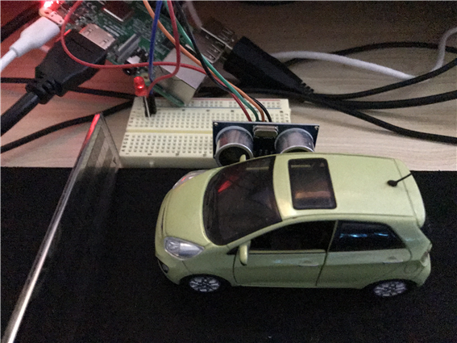
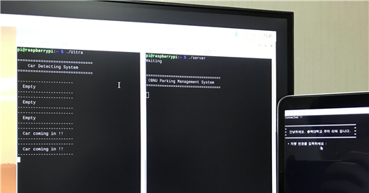
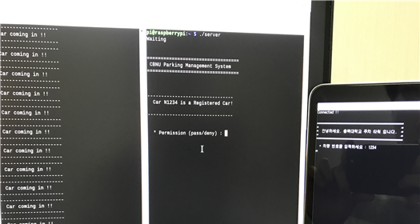
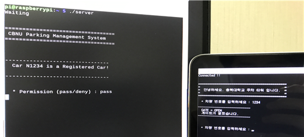
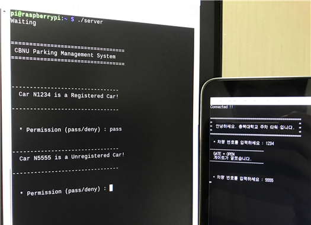

   
  
   
  <h1>인터넷통신설계 (Internet Communication Design)</h1>
  <h1>주차장 출입문 관리 시스템</h1>  
   

## 💁🏻‍♂ 프로젝트 소개

우리 주변에 있는 아파트, 상가 그리고 학교 등에서 쉽게 볼 수 있는 `주차 관리 시스템 설계`

 

## 🛠 기술 스택

**IoT**

- 
- 

 

## 💡 주요 기능

&nbsp;&nbsp;초음파 센서를 통해 차량이 주차장 입구에 `접근 여부를 감지`하고 감지와 동시에 `차량이 감지되었다는 안내 문구 출력과 LED 등을 깜박`이게 설계하였다.

&nbsp;&nbsp;주차장에 진입하려는 운전자가 주차장 입구에서 자신의 `차량 번호를 Client 시스템에 입력하면` 주차 관리 시스템 역할을 하는 `Server 시스템에서 전달받은 차량 번호가 시스템에 등록되어 있는지 확인` 후 `관리자에게 차량의 등록 여부를 메시지를 통해 전달`한다. 이후 주차 관리자는 메시지를 확인하고 `차량을 pass 시킬지, deny 시킬지 명령을 내릴 수 있다.` `pass를 입력하면` 운전자가 보고있는 `Client 시스템에서 'GATE = OPEN, 게이트가 열렸습니다.'라는 안내 문구`를 띄우게 된다. 반대로 `deny를 입력하면` `Client 시스템에서 'GATE = CLOSE, 등록되지 않은 차량입니다.'라는 안내 문구`를 출력시킨다.

> (임시로 등록된 차량 번호 : 1234, 5678, 9012, 3456, 7890)

 

|                       `차량 접근 전`                        |
| :---------------------------------------------------------: |
|  |
|  |

|              `차량이 주차장 출입구에 도착 시`               |
| :---------------------------------------------------------: |
|  |
|  |

|                 `등록된 차량 번호 입력 시`                  |
| :---------------------------------------------------------: |
|  |

|                    `등록된 차량 pass 시`                    |
| :---------------------------------------------------------: |
|  |

|                `미등록된 차량 번호 입력 시`                 |
| :---------------------------------------------------------: |
|  |

|                   `미등록된 차량 deny 시`                   |
| :---------------------------------------------------------: |
|  |
